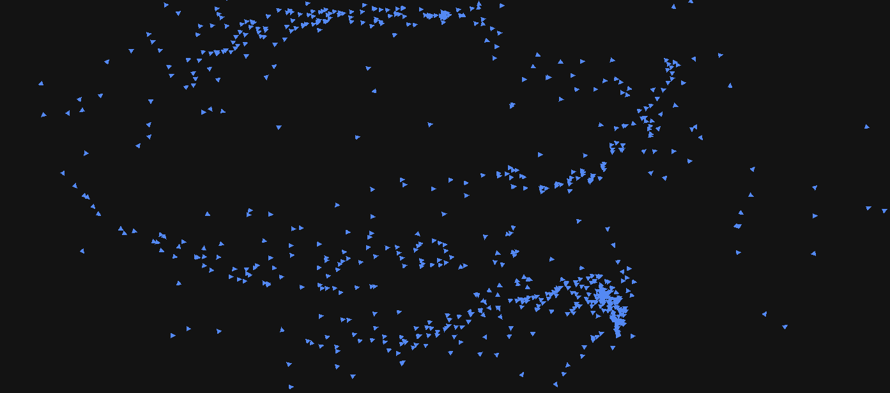

# Flocking

Challenge _mini_ project developed during "Self Dev Days" at Laparo.

Currently, this is a brute-force _flocking model_ implementation.
Possible upgrades are planned to do during the next "Self Dev Days".
The model is more or less based on these papers:[^1],[^2], and [^3].

Example **VIDEO**. TODO

Download build (for Windows) demo: **TODO**

Check web demo browser version: **TODO** 🔴WARNING🔴 _Currently Burst is not supported for WebGL builds, maximum boids count is reduced._)

## Dependencies

- [`Unity.Burst`](https://docs.unity3d.com/Packages/com.unity.burst@1.6/manual/index.html)
- [`Unity.Jobs`](https://docs.unity3d.com/Manual/JobSystem.html)
- [`andywiecko.BurstMathUtils`](https://github.com/andywiecko/BurstMathUtils.git)

## TODO

Things to consider:

- [ ] Try ECS.
- [X] ~~Try WebGL build.~~
- [ ] Optimization: spatial hashing/quad tree.
- [ ] Obstacle avoidance.
- [ ] Express forces in PBD framework.
- [ ] Additional force with respect to the defined path.
- [ ] Add random force (should prevent from boids gluing?)

## Bibliography

[^1]:H. Hildenbrandt, C. Carere, C.K. Hemelrijk, "Self-organized aerial displays of thousands of starlings: a model," [Behavioral Ecology, **21**, 6, (2010)](https://doi.org/10.1093/beheco/arq149).

[^2]:C.K. Hemelrijk and H. Hildenbrandt. "Some causes of the variable shape of flocks of birds." [PloS one 6.8 (2011): e22479](https://doi.org/10.1371/journal.pone.0022479).

[^3]:C. Hartman and B. Benes. "Autonomous boids," [Computer Animation and Virtual Worlds **17**.3‐4 (2006)](https://doi.org/10.1002/cav.123).
